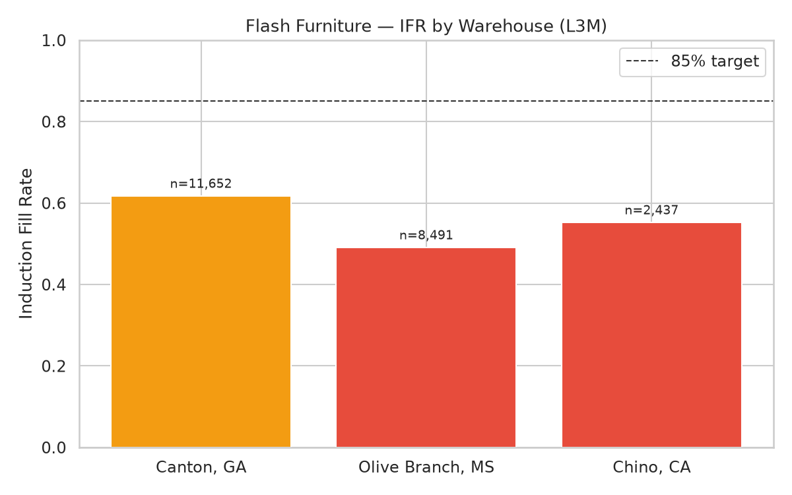
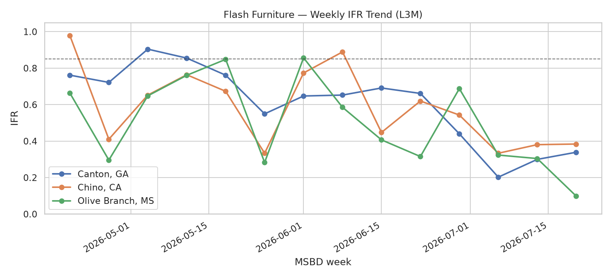
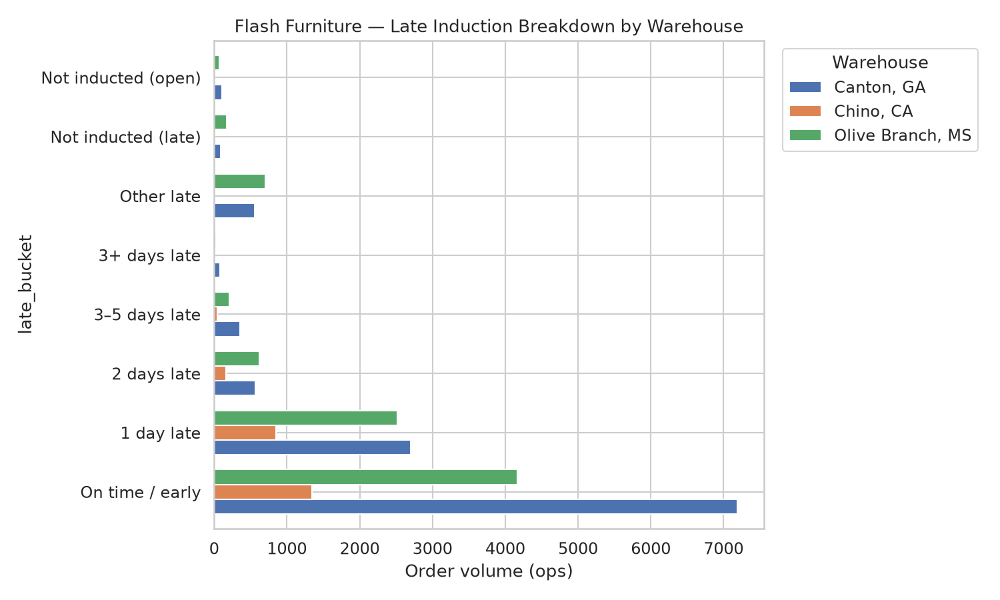
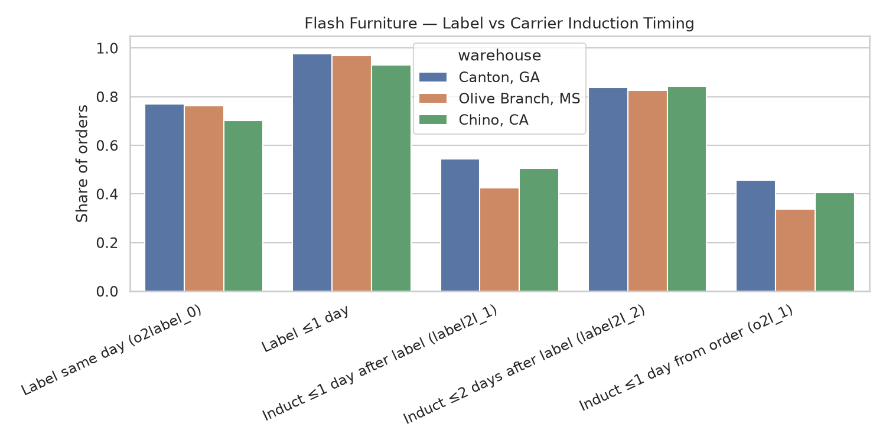
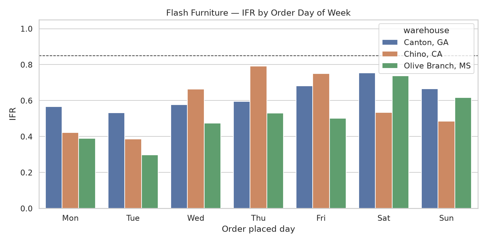
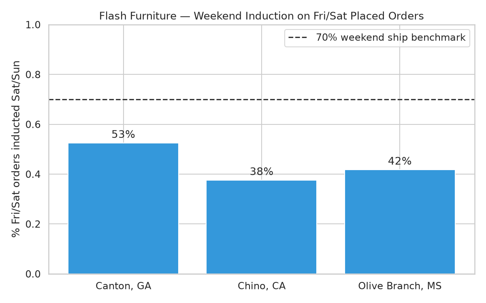

# Flash Furniture — Account Manager Pre-Read

**Meeting:** Flash Furniture induction performance review  
**Generated:** 2026-07-23  
**Scope:** Dropship only (`fulfillment_type = 'DS'`) · Past 3 months · MSBD timebase

---

## TL;DR for the AM

Flash Furniture is **missing induction on ~44% of dropship orders** (9,873 of 22,580 ops). Network IFR is **56.3%** vs an 85% target.

**This is not a labeling problem.** Labels are created within 1 day on **97%** of orders. The gap is **carrier pickup / first scan**: only **50%** of orders are inducted within 1 day of label print. **6,076** late orders are only **1 day past MSBD** — pointing to missed next-day pickup, not multi-day warehouse delays.

**July performance has deteriorated sharply** at Canton and Olive Branch. Olive Branch remains the weakest site overall.

**Framing for the supplier:** *"Your warehouses are labeling on time — we need to align FedEx pickup and first-scan timing with MSBD."*

---

## Warehouse snapshot (L3M)

| Warehouse | Volume | IFR |
|-----------|-------:|----:|
| Canton, GA | 11,652 | 61.7% |
| Olive Branch, MS | 8,491 | 49.1% |
| Chino, CA | 2,437 | 55.2% |

## Recent trend (last 4 weeks)

| Warehouse | Volume | IFR |
|-----------|-------:|----:|
| Canton, GA | 2,657 | 31.7% |
| Olive Branch, MS | 1,918 | 33.6% |
| Chino, CA | 420 | 42.1% |

---

## Key themes

1. **Label-to-induction gap** — primary driver; late orders have **0.2%** same-day label→induction vs **5.6%** for on-time orders.
2. **1-day-late concentration** — largest late bucket across all three sites.
3. **Olive Branch (MS)** — weakest IFR; Mon/Tue order placement especially poor (OLIVE BRANCH LOCAL station).
4. **Canton (GA)** — highest volume; July IFR collapse needs operational review (MARIETTA LOCAL station).
5. **Weekend gap** — Fri/Sat placed orders not getting Sat/Sun induction at scale.
6. **Not LT/cushion** — all on 24hr SP LT; this is pickup/induction, not policy.

---

## Questions to drive in the meeting

1. What is the **FedEx pickup schedule** at each warehouse, and does it align with label cutoff?
2. What **changed in July** (staffing, volume, carrier, cutoff)?
3. Why is **Olive Branch Mon/Tue** underperforming?
4. Can we enable **weekend pickup** or adjust processing for Fri/Sat orders?
5. Will Flash commit to tracking **label-to-induction same day** weekly by site?

---

## Supporting charts

### IFR by warehouse

### Weekly IFR trend

### Late bucket breakdown

### Label vs induction timing

### IFR by order day of week

### Weekend induction gap

---

## Order-level data (linked)

| File | Rows | Description |
|------|-----:|-------------|
| [All DS orders (L3M)](https://github.com/et844p/O2S/blob/main/output/flash_furniture/flash_furniture_orders_l3m.csv) | 22,580 | Full order-level export with induction, label, and routing fields |
| [Late orders only](https://github.com/et844p/O2S/blob/main/output/flash_furniture/flash_furniture_late_orders_l3m.csv) | 9,873 | Orders that missed on-time induction — use for PO examples |

**Full technical write-up:** [flash_furniture_induction_analysis.md](flash_furniture_induction_analysis.md)

---

*Note: Analysis excludes CastleGate (`fulfillment_type = 'CG'`) orders. Supplier-facing metrics should always use DS only.*
