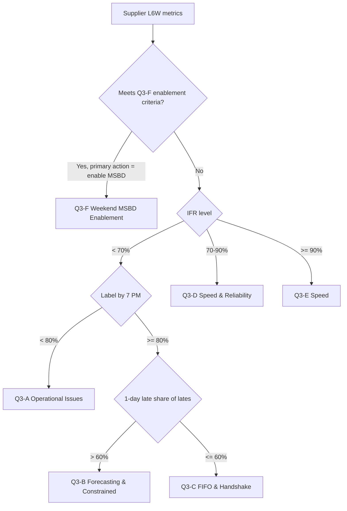

# Q3 Sprint — Cohort Definitions

Cohort assignment uses a **last-6-week (L6W)** baseline on `HVE_perf_Monitoring`, `fulfillment_type = 'DS'`, unless noted otherwise.

## Metrics used for routing

| Metric | Definition | Column / calculation |
|--------|------------|----------------------|
| IFR | % inducted on or before MSBD | `AVG(inducted_on_time_or_early)` |
| Label by 7 PM | % labels printed by 7 PM on MSBD | `AVG(label_by_msbd_7)` |
| 1-day late share | % of late volume that is exactly 1 day late | `SUM(one_day_late) / SUM(inducted_late)` among late orders |
| Weekend ship rate | % of Fri/Sat placed orders inducted Sat/Sun | See `sql/weekend_shipping_supplier_analysis.sql` |
| Constrained market | Supplier inducts into capacity-constrained hub | `assigned_constrained_market = 1` |
| Gap label → induction | Label printed but inducted > 1 calendar day later | Derived from `event_datetime` vs `induction_date_lidd` |

## Primary routing (IFR + reliability tiers)

Evaluate in order — first match wins.

### Q3-A — Operational Issues

**Criteria**

- `IFR < 70%`
- `Label by 7 PM < 80%`

**Email focus**

- Warehouse execution, label printing cadence, backlog
- **Do not** push weekend MSBD enablement until fundamentals improve

**Discovery themes** (from Summer 2026 Cohort C)

- Label printing frequency vs pickup schedule
- Internal cutoff times
- Backlog carryover

---

### Q3-B — Reliability: Forecasting & Constrained Markets

**Criteria**

- `IFR < 70%`
- `Label by 7 PM ≥ 80%`
- `1-day late share > 60%` of total late volume

**Email focus**

- FedEx forecasting and trailer planning
- Agreeing on induction cutoff times with FedEx
- Weekend shipping as a lever to spread volume

**Talk track**

> What is the latest that FedEx will pick up a trailer and induct same day, or next day by 8 AM?

**Conditional copy**

- `{{#IF_CONSTRAINED_MARKET}}` — include constrained-market peak context (limited ad hoc trailer capacity)
- All suppliers in this cohort receive weekend shipping section

---

### Q3-C — Reliability: FIFO & Handshake

**Criteria**

- `IFR < 70%`
- `Label by 7 PM ≥ 80%`
- `1-day late share ≤ 60%` of total late volume
- OR significant label-to-induction gap (> 1 day between label and induction)

**Email focus**

- FIFO execution, dock clearing, Wayfair volume prioritization
- Handshake issues with FedEx (trailers picked up but inducted next day 8 AM–2 PM)
- Trailer pickup optimization

**Conditional copy**

- `{{#IF_CONSTRAINED_MARKET}}` — include weekend shipping section
- `{{#IF_NOT_CONSTRAINED_MARKET}}` — omit weekend shipping section; focus on handshake/FIFO only

---

### Q3-D — Speed & Reliability (IFR 70–90%)

**Criteria**

- `70% ≤ IFR < 90%`

**Email focus**

- Sustain and improve IFR toward 93% target
- Weekend shipping to protect reliability during peak
- Accurate FedEx forecasting
- Building directs and splitting conveyable / non-conveyable

**Conditional copy**

- All suppliers receive weekend shipping section
- `{{#IF_CONSTRAINED_MARKET}}` — add constrained-market peak warning paragraph

---

### Q3-E — Speed (IFR > 90%)

**Criteria**

- `IFR ≥ 90%`

**Email focus**

- Weekend MSBD enablement for faster customer promises
- Protect reliability during high-volume periods
- Leverage weekly/biweekly FedEx forecast sends
- Low click rate on forecast tool (remind to use it)

**Conditional copy**

- All suppliers receive weekend shipping enablement section
- `{{#IF_CONSTRAINED_MARKET}}` — emphasize peak capacity planning

---

### Q3-F — Weekend MSBD Enablement (separate track)

**Criteria** (from weekend shipping analysis)

- `sp_lt = 24`
- `l6w_pct_fri_sat_shipped_sat_sun ≥ 70%`
- `l6w_ifr > 85%`
- `l6w_fri_sat_volume > 0`

**Email focus**

- **Opportunity**, not remediation
- Enable Sunday (or Saturday) MSBD to match existing weekend operations
- Align system settings with demonstrated performance

**Note:** Q3-F can overlap with Q3-E suppliers who also meet enablement criteria. Prefer Q3-F template when the primary action is MSBD enablement; use Q3-E when IFR is strong but weekend rate is below 70%.

---

## Secondary IFR sub-cohorts (within Q3-A/B/C)

When building discovery questions inside reliability emails, use late-volume pattern to select the question block (mirrors Summer 2026):

| Sub-code | Late pattern | Question block ID |
|----------|--------------|-------------------|
| A | > 20% of lates inducted next day between 8 AM–2 PM | `LATE_PICKUP_8_2` |
| B | > 20% of lates are 3+ days late | `EGREGIOUS_LATE` |
| C | < 97% label by 7 PM | `LABEL_COMPLIANCE` |
| D | > 20% of lates inducted 1 day late (general handshake) | `HANDSHAKE_1DAY` |

Map sub-code via order-level late distribution at the supplier level.

---

## Decision tree

## Volume thresholds

- Minimum L6W volume for outreach: **500 distinct ops** (consistent with weekend shipping analysis)
- Repeat suppliers from Summer 2026: include `{{#IF_REPEAT_TARGET}}` context block explaining continued targeting
