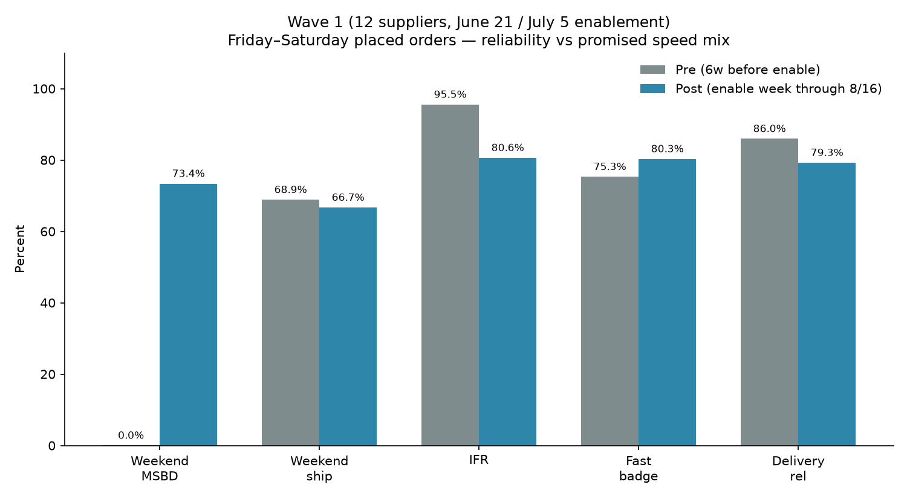
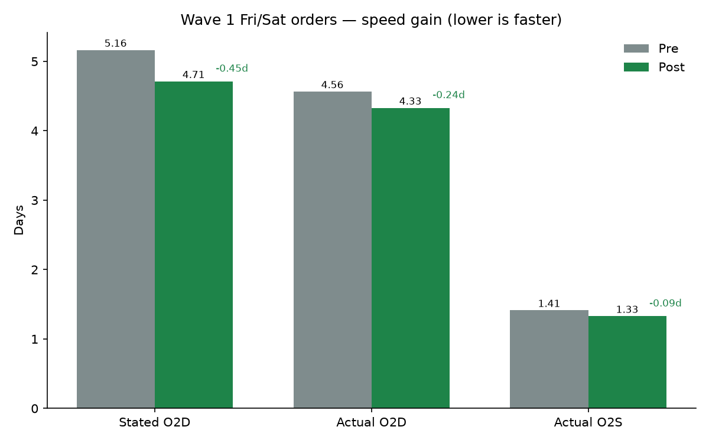
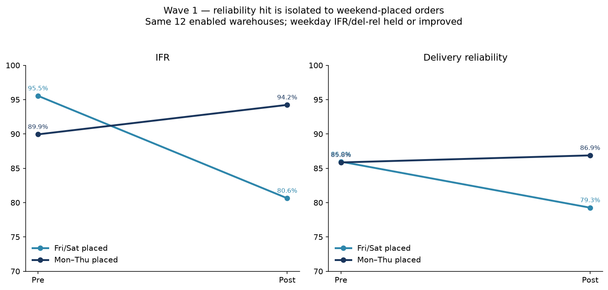
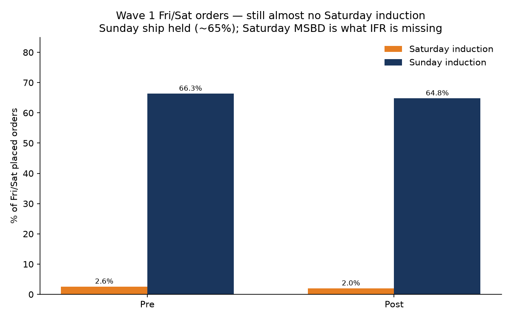
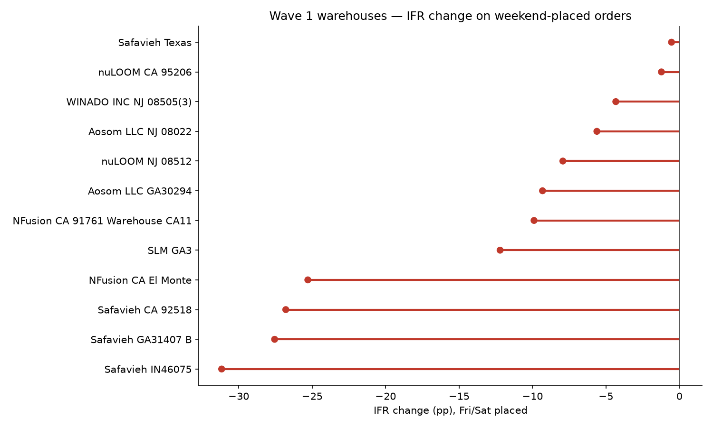
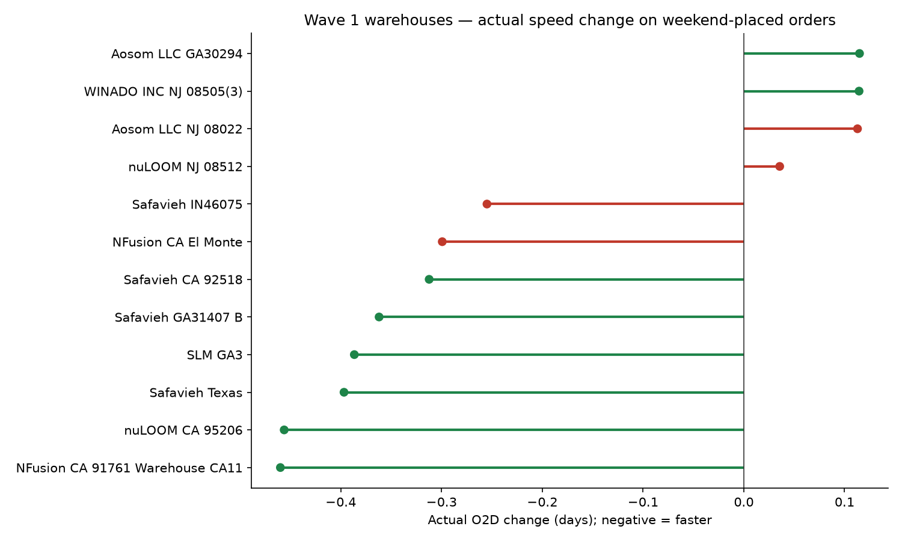
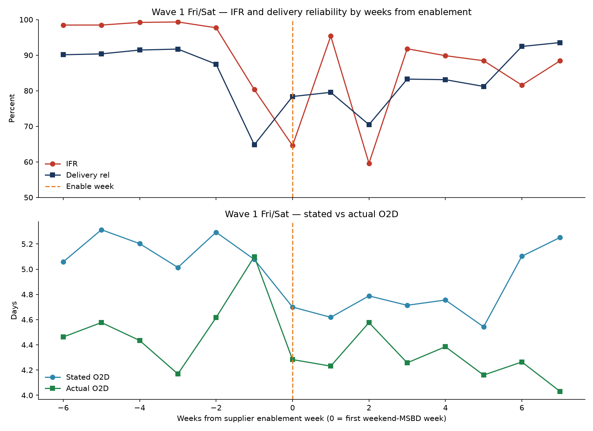
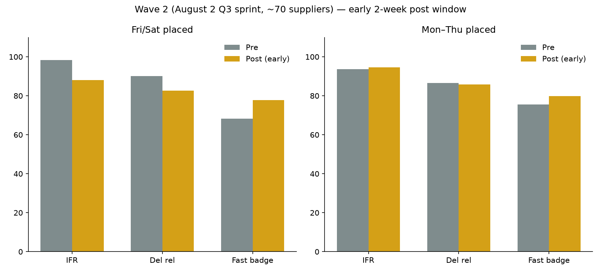

# Weekend shipping enablement — pre vs post impact

Generated: 2026-08-31

June–July Wave 1 enabled **weekend Must Ship By Date** for 24-hour dropship warehouses that were already inducting Fri/Sat orders over the weekend. This rerun measures whether those warehouses are performing, the speed gain, and delivery reliability on **Friday–Saturday placed orders**.

An August 2 Q3 sprint wave is included as an early read (short post window).

## Bottom line

Wave 1 (12 warehouses; nuLOOM NJ on **2026-06-21**, then Safavieh / Aosom / GigaCloud / SLM / WINADO / nuLOOM CA on **2026-07-05 / 07-12**):

- **Setting took:** Fri/Sat weekend MSBD share went from 0.0% to 73.4%.
- **Speed improved, but less than the promise:** stated O2D 5.16 → 4.71 days (-0.45d); actual O2D 4.56 → 4.33 (-0.24d). Fast badge 75.3% → 80.3% (+5.0 pp).
- **Excel:** all warehouse-level pre/post rows plus this summary are in `output/weekend_shipping_pre_post/weekend_shipping_pre_post_supplier.xlsx`.
- **Reliability got worse on weekend-placed orders:** IFR 95.5% → 80.6% (-14.9 pp); delivery reliability 86.0% → 79.3% (-6.7 pp).
- **Operations did not move to Saturday:** weekend induction held (68.9% → 66.7%), but it is almost all **Sunday** (64.8%) vs **Saturday** (2.0%). Friday orders with a Saturday MSBD that induct Sunday miss IFR.
- **Weekdays for the same warehouses improved:** IFR 89.9% → 94.2%; delivery reliability 85.8% → 86.9%. The miss is weekend-order specific.

Wave 2 (72 warehouses, enable week **2026-08-02**; post is only ~2 weeks through 8/16) shows the same pattern: promised speed and fast-badge up, IFR and delivery reliability down on Fri/Sat orders.

## Wave 1 — overall stated speed and badging (all order days)

This is the warehouse-level mix including weekdays, so the stated-speed move is smaller than the Fri/Sat-only slice, but it is the right view for “did promises get faster overall.”

| Metric | Pre | Post | Change |
| --- | ---: | ---: | ---: |
| Volume (distinct ops) | 135,999 | 122,268 | — |
| Weekend MSBD share | 0.0% | 24.0% | +24.0 pp |
| Weekend ship (Sat+Sun adj) | 20.2% | 20.0% | -0.2 pp |
| Saturday induction | 0.9% | 0.6% | -0.3 pp |
| Sunday induction | 19.4% | 19.5% | +0.1 pp |
| IFR (on-time vs supplier MSBD) | 91.7% | 86.9% | -4.8 pp |
| Late orders | 11,316 | 16,014 | +4,698 |
| Stated O2S (days, o2sumsbd) | 1.39 | 1.03 | -0.36d |
| 1-day stated O2S share | 55.5% | 64.1% | +8.5 pp |
| Stated O2D (days) | 4.56 | 4.23 | -0.33d |
| Actual O2D (days) | 3.96 | 3.74 | -0.22d |
| Actual O2S (days) | 1.03 | 0.96 | -0.07d |
| Fast badge (stated O2D ≤ 5) | 80.9% | 83.9% | +3.0 pp |
| Actual O2D ≤ 5 | 83.3% | 85.5% | +2.2 pp |
| Delivery reliability | 86.6% | 84.9% | -1.7 pp |

## Wave 1 — Friday/Saturday placed orders

12 24-hour DS warehouses. Pre = 6 weeks before each warehouse’s first weekend-MSBD week. Post = enable week through 2026-08-16 (14-day delivery lag).

| Metric | Pre | Post | Change |
| --- | ---: | ---: | ---: |
| Volume (distinct ops) | 35,842 | 33,005 | — |
| Weekend MSBD share | 0.0% | 73.4% | +73.3 pp |
| Weekend ship (Sat+Sun adj) | 68.9% | 66.7% | -2.2 pp |
| Saturday induction | 2.6% | 2.0% | -0.6 pp |
| Sunday induction | 66.3% | 64.8% | -1.6 pp |
| IFR (on-time vs supplier MSBD) | 95.5% | 80.6% | -14.9 pp |
| Late orders | 1,596 | 6,391 | +4,795 |
| Stated O2S (days, o2sumsbd) | 2.29 | 1.33 | -0.96d |
| 1-day stated O2S share | 0.0% | 45.8% | +45.8 pp |
| Stated O2D (days) | 5.16 | 4.71 | -0.45d |
| Actual O2D (days) | 4.56 | 4.33 | -0.24d |
| Actual O2S (days) | 1.41 | 1.33 | -0.09d |
| Fast badge (stated O2D ≤ 5) | 75.3% | 80.3% | +5.0 pp |
| Actual O2D ≤ 5 | 78.3% | 80.5% | +2.2 pp |
| Delivery reliability | 86.0% | 79.3% | -6.7 pp |

### Same warehouses, Monday–Thursday placed (within-supplier control)

| Metric | Pre | Post | Change |
| --- | ---: | ---: | ---: |
| Volume (distinct ops) | 76,415 | 65,191 | — |
| Weekend MSBD share | 0.0% | 1.9% | +1.9 pp |
| Weekend ship (Sat+Sun adj) | 1.0% | 0.3% | -0.7 pp |
| Saturday induction | 0.3% | 0.1% | -0.2 pp |
| Sunday induction | 0.6% | 0.2% | -0.4 pp |
| IFR (on-time vs supplier MSBD) | 89.9% | 94.2% | +4.3 pp |
| Late orders | 7,689 | 3,762 | -3,927 |
| Stated O2S (days, o2sumsbd) | 0.99 | 0.90 | -0.09d |
| 1-day stated O2S share | 75.4% | 68.1% | -7.3 pp |
| Stated O2D (days) | 4.30 | 4.00 | -0.30d |
| Actual O2D (days) | 3.71 | 3.46 | -0.25d |
| Actual O2S (days) | 0.84 | 0.73 | -0.10d |
| Fast badge (stated O2D ≤ 5) | 81.2% | 83.4% | +2.2 pp |
| Actual O2D ≤ 5 | 83.8% | 86.0% | +2.2 pp |
| Delivery reliability | 85.8% | 86.9% | +1.0 pp |

## Wave 1 warehouse detail (Fri/Sat)

| Warehouse | Enable week | Pre vol | Post vol | IFR pre → post | Del rel pre → post | Stated O2D | Actual O2D | Sat ship post | Sun ship post |
| --- | --- | ---: | ---: | --- | --- | --- | --- | ---: | ---: |
| Safavieh Texas | 2026-07-05 | 5,076 | 5,627 | 80.8% → 80.3% (-0.5 pp) | 74.9% → 71.8% (-3.1 pp) | 4.71 → 4.29 (-0.42d) | 4.58 → 4.18 (-0.40d) | 0.0% | 61.2% |
| Safavieh IN46075 | 2026-07-05 | 5,295 | 5,332 | 93.3% → 62.1% (-31.2 pp) | 76.6% → 72.0% (-4.6 pp) | 4.69 → 4.23 (-0.46d) | 4.40 → 4.14 (-0.25d) | 0.2% | 48.2% |
| nuLOOM NJ 08512 | 2026-06-21 | 4,446 | 5,056 | 98.7% → 90.8% (-7.9 pp) | 92.2% → 85.7% (-6.5 pp) | 5.14 → 4.81 (-0.33d) | 4.08 → 4.11 (+0.04d) | 2.3% | 69.2% |
| Safavieh CA 92518 | 2026-07-05 | 3,222 | 3,160 | 98.8% → 72.0% (-26.8 pp) | 86.2% → 80.5% (-5.7 pp) | 5.43 → 5.04 (-0.39d) | 4.89 → 4.58 (-0.31d) | 0.1% | 52.7% |
| Safavieh GA31407 B | 2026-07-05 | 2,455 | 2,738 | 99.1% → 71.5% (-27.6 pp) | 81.4% → 84.0% (+2.6 pp) | 4.90 → 4.50 (-0.41d) | 4.36 → 4.00 (-0.36d) | 0.0% | 53.9% |
| WINADO INC NJ 08505(3) | 2026-07-05 | 1,926 | 2,291 | 99.0% → 94.6% (-4.3 pp) | 92.7% → 87.6% (-5.1 pp) | 5.07 → 4.97 (-0.10d) | 4.09 → 4.21 (+0.11d) | 0.0% | 82.6% |
| Aosom LLC GA30294 | 2026-07-05 | 2,756 | 1,775 | 99.3% → 90.0% (-9.3 pp) | 94.0% → 79.7% (-14.3 pp) | 4.70 → 4.36 (-0.34d) | 4.01 → 4.13 (+0.11d) | 0.0% | 82.8% |
| SLM GA3 | 2026-07-05 | 3,383 | 1,722 | 99.0% → 86.8% (-12.2 pp) | 91.4% → 90.3% (-1.1 pp) | 5.86 → 4.93 (-0.93d) | 4.90 → 4.52 (-0.39d) | 0.2% | 85.1% |
| NFusion CA 91761 Warehouse CA11 | 2026-07-05 | 1,902 | 1,690 | 97.5% → 87.6% (-9.9 pp) | 85.1% → 81.0% (-4.1 pp) | 6.45 → 6.09 (-0.36d) | 6.21 → 5.75 (-0.46d) | 0.0% | 90.9% |
| Aosom LLC NJ 08022 | 2026-07-05 | 2,309 | 1,329 | 99.5% → 93.9% (-5.6 pp) | 93.7% → 69.7% (-24.0 pp) | 4.49 → 4.21 (-0.28d) | 3.91 → 4.02 (+0.11d) | 0.0% | 85.0% |
| nuLOOM CA 95206 | 2026-07-12 | 1,684 | 1,158 | 99.6% → 98.4% (-1.2 pp) | 92.9% → 80.7% (-12.2 pp) | 5.86 → 5.11 (-0.75d) | 4.78 → 4.33 (-0.46d) | 44.1% | 29.5% |
| NFusion CA El Monte | 2026-07-05 | 1,388 | 1,127 | 99.2% → 73.9% (-25.3 pp) | 90.9% → 79.8% (-11.1 pp) | 6.40 → 6.00 (-0.40d) | 5.80 → 5.50 (-0.30d) | 0.0% | 79.2% |

WINADO’s post weekend-MSBD share did not stay high after the first week — treat as not sustained.

## Wave 2 early read (August 2 Q3 sprint)

Post window is 2026-08-02 through 2026-08-16 only. Directionally the same as Wave 1 on Fri/Sat orders: weekend MSBD 0.2% → 88.8%; IFR 98.4% → 88.1%; delivery reliability 90.2% → 82.6%; stated O2D 5.30 → 4.81; actual O2D 4.57 → 4.32. Saturday induction is higher than Wave 1 (11.9%) but still minority vs Sunday (61.7%).

### Wave 2 overall (all order days) — stated speed and badging

| Metric | Pre | Post | Change |
| --- | ---: | ---: | ---: |
| Volume (distinct ops) | 140,470 | 45,808 | — |
| Weekend MSBD share | 0.1% | 23.2% | +23.1 pp |
| Weekend ship (Sat+Sun adj) | 24.9% | 22.6% | -2.3 pp |
| Saturday induction | 4.1% | 3.3% | -0.8 pp |
| Sunday induction | 20.8% | 19.3% | -1.4 pp |
| IFR (on-time vs supplier MSBD) | 94.4% | 91.5% | -2.9 pp |
| Late orders | 7,895 | 3,884 | -4,011 |
| Stated O2S (days, o2sumsbd) | 1.52 | 1.09 | -0.43d |
| 1-day stated O2S share | 60.4% | 78.7% | +18.3 pp |
| Stated O2D (days) | 4.71 | 4.31 | -0.40d |
| Actual O2D (days) | 4.04 | 3.78 | -0.26d |
| Actual O2S (days) | 1.00 | 0.96 | -0.04d |
| Fast badge (stated O2D ≤ 5) | 75.7% | 81.7% | +6.0 pp |
| Actual O2D ≤ 5 | 80.0% | 84.0% | +4.0 pp |
| Delivery reliability | 87.9% | 86.0% | -1.9 pp |

| Metric | Pre | Post | Change |
| --- | ---: | ---: | ---: |
| Volume (distinct ops) | 38,797 | 11,718 | — |
| Weekend MSBD share | 0.2% | 88.8% | +88.6 pp |
| Weekend ship (Sat+Sun adj) | 76.7% | 73.5% | -3.2 pp |
| Saturday induction | 13.7% | 11.9% | -1.8 pp |
| Sunday induction | 63.1% | 61.7% | -1.4 pp |
| IFR (on-time vs supplier MSBD) | 98.4% | 88.1% | -10.3 pp |
| Late orders | 619 | 1,393 | +774 |
| Stated O2S (days, o2sumsbd) | 2.46 | 1.42 | -1.04d |
| 1-day stated O2S share | 0.0% | 49.5% | +49.5 pp |
| Stated O2D (days) | 5.30 | 4.81 | -0.49d |
| Actual O2D (days) | 4.57 | 4.32 | -0.25d |
| Actual O2S (days) | 1.26 | 1.21 | -0.05d |
| Fast badge (stated O2D ≤ 5) | 68.2% | 77.8% | +9.6 pp |
| Actual O2D ≤ 5 | 75.6% | 78.9% | +3.3 pp |
| Delivery reliability | 90.2% | 82.6% | -7.6 pp |

Full Wave 2 warehouse file: `output/weekend_shipping_pre_post/weekend_shipping_pre_post_supplier.xlsx` (sheets `Supplier_FriSat` and `Supplier_Overall`).

## 24hr control (not enabled)

24-hour DS suppliers with **no** Fri/Sat weekend MSBD on/after 2026-06-21. Calendar windows: pre 5/03–6/21, post 7/05–8/16.

Fri/Sat control: IFR 91.8% → 90.8% (-1.0 pp); delivery reliability 83.4% → 82.9% (-0.5 pp); actual O2D 5.39 → 5.06 (-0.33d). Control reliability did not drop the way enabled Fri/Sat orders did.

## Hurt from the Sunday-MSBD pull set

Counterfactual: hold Fri/Sat IFR and Fri/Sat delivery reliability at each warehouse’s own **pre** rate, then compare to observed post. Weekday post is left as-is (it improved at most of these buildings).

### Wave 1 pull (Safavieh IN / GA / CA + NFusion El Monte)

These four are 27% of the warehouses’ volume but **51% of their lates** after enablement.

| Slice | Pre | Post | Change |
| --- | ---: | ---: | ---: |
| Fri/Sat IFR | 96.5% | 67.8% | **-28.7 pp** |
| Fri/Sat delivery reliability | 81.7% | 77.5% | **-4.2 pp** |
| Weekday IFR | 89.9% | 95.0% | +5.0 pp |
| Weekday delivery reliability | 84.3% | 87.2% | +2.9 pp |
| **Overall IFR (all days)** | **91.6%** | **83.1%** | **-8.5 pp** |
| Overall delivery reliability | 83.6% | 84.7% | +1.1 pp |

- Extra Fri/Sat IFR lates vs holding pre IFR: **+3,550** (3,980 observed vs 430 expected).
- Extra Fri/Sat delivery misses vs holding pre del-rel: **+512**.
- If Fri/Sat IFR had stayed at 96.5%, overall IFR would be **90.8%** instead of 83.1%. The weekend miss accounts for **7.7 pp** of the 8.5 pp overall IFR drop. Weekdays actually offset some of the damage.

Warehouse-level (post window through 8/16):

| Warehouse | Extra Fri/Sat IFR lates | Extra Fri/Sat del misses | Overall IFR Δ | of which weekend |
| --- | ---: | ---: | ---: | ---: |
| Safavieh IN46075 | 1,747 | 253 | -12.3 pp | 10.4 pp |
| Safavieh CA 92518 | 788 | 134 | -7.4 pp | 8.6 pp |
| Safavieh GA31407 B | 721 | 96 | -6.9 pp | 8.4 pp |
| NFusion CA El Monte | 294 | 29 | -4.4 pp | 4.7 pp |

Safavieh CA/GA overall IFR would have *risen* if Fri/Sat had held, because weekdays got better.

### All 17 super-poor warehouses (Wave 1 pull + Wave 2 early)

Same pattern, noisier because Wave 2 post is only ~2 weeks.

| Slice | Pre | Post | Change |
| --- | ---: | ---: | ---: |
| Fri/Sat IFR | 92.3% | 62.3% | **-30.0 pp** |
| Fri/Sat delivery reliability | 86.2% | 79.0% | **-7.2 pp** |
| Weekday IFR | 92.3% | 90.8% | -1.5 pp |
| **Overall IFR** | **92.3%** | **83.1%** | **-9.2 pp** |

- Extra Fri/Sat IFR lates: **+5,563**. Extra Fri/Sat delivery misses: **+1,059**.
- Weekend-attributable overall IFR hit: **8.0 pp** of the 9.2 pp drop (counterfactual overall IFR 91.1% if Fri/Sat had held).
- Fri/Sat is 27% of volume and **52% of lates**.

Standouts:

- **TwinXLcom MN:** Fri/Sat del-rel 91.7% → 50.0% (**-41.7 pp**, +148 extra delivery misses). Overall IFR -7.1 pp, almost all weekend (+6.8 pp). Weekday IFR held.
- **AMEZIEL IN 46219:** Fri/Sat is 30% of volume but **93% of lates**. Overall IFR -20.6 pp; **19.8 pp is weekend**. Weekdays are fine (96.9% IFR).
- **aifei GA 30517:** overall IFR crash is **not** weekend-only — weekday IFR also collapsed (91.9% → 49.1%). Pulling Sunday MSBD would not fix this supplier.

## What this means

1. **Enablement worked in the promise:** weekend MSBD is on; stated O2D and 5-day badging improved on Fri/Sat orders.
2. **Warehouses are not failing to ship weekends** — they still induct ~65% of Fri/Sat orders on Sunday. They are failing **Saturday** induction, which is what the new MSBD requires for Friday orders.
3. **Do not read IFR as “they stopped trying.”** Tighter Saturday MSBD converted prior Sunday-early (vs Monday MSBD) into Sunday-late (vs Saturday MSBD).
4. **Delivery reliability followed IFR down** on weekend-placed orders only. Weekday del-rel for the same buildings is stable/up.
5. **Next lever:** Saturday FedEx pickup / Saturday induction at Wave 1 buildings (especially Safavieh IN/TX/CA and NFusion El Monte) before adding more weekend-MSBD enablement. nuLOOM CA is the closest to a Saturday-ship success case.

## Methodology

| Item | Rule |
| --- | --- |
| Table | `` `wf-gcp-us-ae-global-tnd-prod.speed_and_reliability.HVE_perf_Monitoring` `` |
| Fulfillment | `fulfillment_type = 'DS'`, `sp_lt = 24` |
| Weekend-placed cohort | Friday + Saturday orders: `order_dow IN (6, 7)` |
| Weekday control | Monday–Thursday: `order_dow IN (2, 3, 4, 5)` |
| Day-of-week | **Sunday = 1 … Saturday = 7** for `order_dow` and `induction_dow_adj` (verified vs calendar dates) |
| Weekend ship | `induction_dow_adj IN (1, 7)` — not `inducted_over_weekend` (that flag undercounts Sunday scans) |
| Weekend MSBD | `EXTRACT(DAYOFWEEK FROM msbd_su) IN (1, 7)` |
| Enabled | First week on/after 2026-06-21 with ≥20 Fri/Sat ops and ≥10% weekend MSBD; prior 6-week weekend-MSBD average < 5% |
| Pre / post | Supplier-specific: 6 weeks before enable week vs enable week through 2026-08-16 |
| Volume | `COUNT(DISTINCT ops)` |
| IFR | `AVG(inducted_on_time_or_early)` |
| Delivery reliability | `AVG(delivery_rel)` among rows with `delivery_date IS NOT NULL` |
| Speed | Stated O2S = `AVG(o2sumsbd)`; stated O2D = `AVG(o2d_stated)`; actual O2S/O2D; 1-day O2S = `AVG(o2s_stated_1)`; fast badge = `AVG(o2d_stated_5)` |

The July 2026 candidate finder (`sql/weekend_shipping_supplier_analysis.sql`) treated `order_dow IN (5, 6)` as Fri/Sat. Empirically that is **Thursday + Friday**. This impact rerun uses the corrected Friday + Saturday filter.

## Charts

